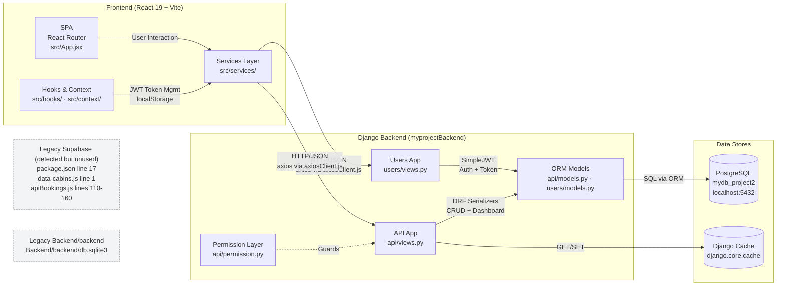

# Hotel Management SPA — Architecture Analysis

---

## OUTPUT 1 — MERMAID FLOWCHART



**Summary:** A React 19 SPA communicates via axios/HTTP-JSON with a Django 5 + DRF backend (SimpleJWT auth, PostgreSQL), featuring CRUD for Cabins/Guests/Bookings/Settings and dashboard analytics; Supabase references and a secondary Backend directory are legacy artifacts.

---

## OUTPUT 2 — THEORETICAL BREAKDOWN

---

### 1. Executive Summary

This project is a **Hotel Management System** built as a Single Page Application. The frontend is React 19 (Vite, styled-components, MUI, React Query, recharts) communicating over HTTP/JSON with a Django 5 + Django REST Framework backend using SimpleJWT for authentication and PostgreSQL for storage. The system manages Hotels, Cabins, Guests, Bookings, and Settings with role-based (Admin/Staff) permissions. **The highest-priority risk is that several critical API endpoints ([CabinCreateListView](file:///c:/Users/theco/Music/Documents/HTML_CSS_JS/React/React-Styled-Componet/styled_Componets/myprojectBackend/api/views.py#63-99), [SingleBookingRetrieveView](file:///c:/Users/theco/Music/Documents/HTML_CSS_JS/React/React-Styled-Componet/styled_Componets/myprojectBackend/api/views.py#211-232), [SettingsCreateListView](file:///c:/Users/theco/Music/Documents/HTML_CSS_JS/React/React-Styled-Componet/styled_Componets/myprojectBackend/api/views.py#239-251)) have `permission_classes = [AllowAny]`, bypassing the well-designed permission system, and database credentials are hardcoded in [settings.py](file:///c:/Users/theco/Music/Documents/HTML_CSS_JS/React/React-Styled-Componet/styled_Componets/myprojectBackend/myprojectBackend/settings.py).**

---

### 2. Component List

---

#### 2.1 Frontend SPA

| Attribute | Detail |
|---|---|
| **Path** | `Frontend/src/` |
| **Purpose** | Renders the hotel management UI: dashboard, cabins, bookings, guests, settings, user account |
| **Tech Stack** | React 19, Vite 7, styled-components 6, MUI 7, React Query 5, axios, recharts 3, react-router-dom 6, react-hook-form 7, react-hot-toast, date-fns |
| **Env Vars** | None (base URL hardcoded in `axiosClient.js`) |

**Key Routes** ([App.jsx](file:///c:/Users/theco/Music/Documents/HTML_CSS_JS/React/React-Styled-Componet/styled_Componets/Frontend/src/App.jsx)):
- `/dashboard`, `/cabins`, `/bookings`, `/bookings/:bookingId`, `/users`, `/settings`, `/account`, `/check-in-out`, `/check-in-out/:bookingId` (protected)
- `/login`, `/register` (public)

**Evidence:**
```jsx
// App.jsx:41-73
<BrowserRouter>
  <Routes>
    <Route element={<ProtectedRoute><AppLayout /></ProtectedRoute>}>
      <Route path="/dashboard" element={<Dashboard />} />
      ...
    </Route>
    <Route path="/login" element={<Login />} />
    <Route path="/register" element={<SignUp />} />
  </Routes>
</BrowserRouter>
```

---

#### 2.2 Services Layer (Frontend API Client)

| Attribute | Detail |
|---|---|
| **Paths** | `Frontend/src/services/axiosClient.js`, `apiBookings.js`, `apiCabins.js`, `apiSettings.js`, `apiUser.js` |
| **Purpose** | Centralised HTTP client with JWT interceptors; API functions for every resource |
| **Key Functions** | `getBookings()`, `getBooking(id)`, `getDashBoardData()`, `getSalesData()`, `getCabins()`, `createCabins()`, `getSettings()`, `logInUser()`, `createUser()`, `getCurrentUser()`, `logOutUser()` |

**Evidence:**
```js
// axiosClient.js:2-9
const BASE_URL = "http://127.0.0.1:8000/";
const axiosClient = axios.create({ baseURL: BASE_URL, ... });
```

---

#### 2.3 Auth Hooks (Frontend)

| Attribute | Detail |
|---|---|
| **Paths** | `Frontend/src/hooks/useAxiosPrivate.js`, `useRefreshToken.js`, `useAuth.js` |
| **Purpose** | Attach JWT Bearer tokens to requests, auto-refresh on 401, manage auth state |

**Evidence:**
```js
// useAxiosPrivate.js:23-27
const requestIntercept = axiosPrivate.interceptors.request.use((config) => {
    if (!config.headers?.Authorization && token)
        config.headers.Authorization = `Bearer ${token}`;
    return config;
});
```

---

#### 2.4 Django API App (`api`)

| Attribute | Detail |
|---|---|
| **Path** | `myprojectBackend/api/` |
| **Purpose** | CRUD endpoints for Cabins, Guests, Bookings, Settings + Dashboard analytics |
| **Key Views** | `CabinCreateListView`, `SingleCabinRetrieveView`, `BookingsCreateListView`, `SingleBookingRetrieveView`, `SettingsCreateListView`, `GetBookingsLastXDaysView`, `GetTodayActivitiesView`, `StayDurationView`, `DailyRevenueLastXDaysView`, `CabinBookedDatesView`, `HomeView` |

**API Routes** ([api/urls.py](file:///c:/Users/theco/Music/Documents/HTML_CSS_JS/React/React-Styled-Componet/styled_Componets/myprojectBackend/api/urls.py)):
```
api/cabins/                          api/cabins/<int:pk>/
api/guests/                          api/guests/<int:pk>/
api/bookings/                        api/bookings/<int:pk>/
api/bookings/read/                   api/settings/
api/settings/<int:pk>/               api/dashboard/bookings/
api/dashboard/activities/today-summary/
api/dashboard/activities/stay-durations/
api/dashboard/revenue/daily/
api/cabins/<int:cabin_id>/booked-dates/
```

---

#### 2.5 Django Users App (`users`)

| Attribute | Detail |
|---|---|
| **Path** | `myprojectBackend/users/` |
| **Purpose** | User registration, login (JWT), logout (blacklist), profile/password updates |
| **Key Views** | `RegisterUserView`, `LoginUserView`, `LogoutView`, `GetCurrentDetails`, `UpdateCurrentUserView`, `UpdateCurrentUserPasswordView` |

**API Routes** ([users/urls.py](file:///c:/Users/theco/Music/Documents/HTML_CSS_JS/React/React-Styled-Componet/styled_Componets/myprojectBackend/users/urls.py)):
```
users/register/          users/login/
users/logout/            users/user/me/
users/user/me/update/profile
users/user/me/update/password
users/token/refresh/     users/token/verify/
```

---

#### 2.6 Data Models

| Model | Key Fields | File |
|---|---|---|
| `Hotel` | name, email, address, staffCapacity, logo | [api/models.py](file:///c:/Users/theco/Music/Documents/HTML_CSS_JS/React/React-Styled-Componet/styled_Componets/myprojectBackend/api/models.py) |
| `Cabins` | name, maxCapacity, regularPrice, discount, image → FK(Hotel, User) | api/models.py |
| `Guests` | fullName, email, nationalID, nationality → FK(Hotel) | api/models.py |
| `Bookings` | startDate, endDate, numNights, totalPrice, status, isPaid → FK(Cabin, Guest, Hotel, User) | api/models.py |
| `Settings` | minBookingLength, maxBookingLength, breakfastPrice → FK(Hotel) | api/models.py |
| `User` | email, name, role(Staff/Admin), hotel → FK(Hotel) | [users/models.py](file:///c:/Users/theco/Music/Documents/HTML_CSS_JS/React/React-Styled-Componet/styled_Componets/myprojectBackend/users/models.py) |
| `Profile` | photo → OneToOne(User) | users/models.py |

---

#### 2.7 Permission Layer

| Attribute | Detail |
|---|---|
| **Path** | `myprojectBackend/api/permission.py` |
| **Purpose** | Granular per-model, per-action permissions with hotel-scoping (`HotelObjectPermissionMixin`) |

> [!WARNING]
> Permissions are **partially bypassed** — `CabinCreateListView`, `SingleCabinRetrieveView`, `SingleBookingRetrieveView`, and `SettingsCreateListView` all use `permission_classes = [AllowAny]` (see views.py lines 70, 110, 228, 247).

---

#### 2.8 PostgreSQL

| Attribute | Detail |
|---|---|
| **Config** | `myprojectBackend/myprojectBackend/settings.py:68-77` |
| **Database** | `mydb_project2` on `localhost:5432`, user `postgres`, password `Best` |

---

#### 2.9 Django Cache

Used in `GetBookingsLastXDaysView` and `DailyRevenueLastXDaysView` via `django.core.cache` for caching dashboard aggregations (timeout 360s / 600s).

---

#### 2.10 Dark Mode Context (Frontend)

| Attribute | Detail |
|---|---|
| **Path** | `Frontend/src/context/DarkModeContext.jsx` |
| **Purpose** | Toggles `dark-mode` / `light-mode` CSS class on `<html>`, persisted in localStorage |

---

### 3. Design Patterns & Architectural Styles Detected

| Pattern | Evidence |
|---|---|
| **Layered Monolith** | Frontend (SPA) → Services → Backend (Django) → Database. All in one repo. |
| **Feature-based folder structure (Frontend)** | `features/authentication/`, `features/bookings/`, `features/cabins/`, `features/dashboard/`, `features/settings/`, `features/check-in-out/` |
| **Repository-like service layer** | Each resource has its own `api*.js` file (`apiBookings.js`, `apiCabins.js`, etc.) acting as data access layer |
| **Custom Permission classes (DRF)** | `AllCabinPermission`, `AllBookingsPermission`, etc. with `HotelObjectPermissionMixin` for multi-tenancy |
| **Token-based auth** | JWT access/refresh tokens stored in localStorage, auto-refresh interceptors |

**Evidence (Feature folders):**
```
Frontend/src/features/
├── authentication/   (11 files)
├── bookings/         (9 files)
├── cabins/           (12 files)
├── check-in-out/     (6 files)
├── dashboard/        (10 files)
└── settings/         (3 files)
```

---

### 4. Core Interaction Trace: User Login → Fetch Dashboard

| Step | Action | File & Code |
|---|---|---|
| 1 | User submits email+password on `/login` page | `Frontend/src/pages/Login.jsx` |
| 2 | `logInUser(formData)` called | `Frontend/src/services/apiUser.js:14-22` — `axiosClient.post("users/login/", formData)` |
| 3 | Request hits Django `LoginUserView.post()` | `myprojectBackend/users/views.py:56-102` |
| 4 | `authenticate(request, email=, password=)` validates credentials | `users/views.py:64` |
| 5 | `RefreshToken.for_user(user)` generates JWT pair | `users/views.py:74-76` |
| 6 | Response returns `{access, refresh, username, email, userRole}` | `users/views.py:79-90` |
| 7 | Frontend stores tokens in `localStorage` (`accessToken`, `refreshToken`) | `Frontend/src/hooks/useRefreshToken.js:26` |
| 8 | User navigates to `/dashboard` — `ProtectedRoute` checks `auth.isAuthAuthenticated` | `Frontend/src/pages/ProtectedRoute.jsx:8` |
| 9 | Dashboard component calls `getDashBoardData({filterValue})` | `Frontend/src/services/apiBookings.js:70-77` — `axiosPrivate.get("api/dashboard/bookings/")` |
| 10 | `useAxiosPrivate` interceptor attaches `Bearer <accessToken>` header | `Frontend/src/hooks/useAxiosPrivate.js:23-27` |
| 11 | Django `GetBookingsLastXDaysView.get()` checks cache, aggregates `Bookings` | `myprojectBackend/api/views.py:317-367` |
| 12 | Response returned with `{totalBookings, totalSales, totalCheckIns, occupancyRate}` | `api/views.py:359-367` |

---

### 5. Security & Risk Highlights

| # | Issue | File & Evidence | Fix |
|---|---|---|---|
| **1** | **DB password hardcoded** | [settings.py:73](file:///c:/Users/theco/Music/Documents/HTML_CSS_JS/React/React-Styled-Componet/styled_Componets/myprojectBackend/myprojectBackend/settings.py#L73) — `"PASSWORD": "Best"` | Move to `.env`: `DB_PASSWORD=os.getenv("DB_PASSWORD")` |
| **2** | **JWT + Django secrets in `.env` committed** | [.env:1-2](file:///c:/Users/theco/Music/Documents/HTML_CSS_JS/React/React-Styled-Componet/styled_Componets/myprojectBackend/.env#L1-L2) — `JWT_SIGNING_KEY="iY-JZcq..."` | Add `.env` to `.gitignore`, rotate keys immediately |
| **3** | **`DEBUG = True` in production-adjacent config** | [settings.py:14](file:///c:/Users/theco/Music/Documents/HTML_CSS_JS/React/React-Styled-Componet/styled_Componets/myprojectBackend/myprojectBackend/settings.py#L14) — `DEBUG = True` | Set `DEBUG = os.getenv("DEBUG", "False") == "True"` |
| **4** | **`ALLOWED_HOSTS` missing** | settings.py — not defined at all | Add `ALLOWED_HOSTS = os.getenv("ALLOWED_HOSTS", "").split(",")` |
| **5** | **`AllowAny` on Cabins CRUD** | [api/views.py:70](file:///c:/Users/theco/Music/Documents/HTML_CSS_JS/React/React-Styled-Componet/styled_Componets/myprojectBackend/api/views.py#L70) — `permission_classes = [AllowAny]` | Restore to `[AllCabinPermission]` (line 69 is commented out) |
| **6** | **`AllowAny` on SingleBooking RUD** | [api/views.py:228](file:///c:/Users/theco/Music/Documents/HTML_CSS_JS/React/React-Styled-Componet/styled_Componets/myprojectBackend/api/views.py#L228) — `permission_classes = [AllowAny]` | Uncomment lines 222-227 to restore proper permissions |
| **7** | **`AllowAny` on Settings list** | [api/views.py:247](file:///c:/Users/theco/Music/Documents/HTML_CSS_JS/React/React-Styled-Componet/styled_Componets/myprojectBackend/api/views.py#L247) | Change to `[AllSettingsPermission]` |
| **8** | **Tokens stored in `localStorage`** | [useRefreshToken.js:26](file:///c:/Users/theco/Music/Documents/HTML_CSS_JS/React/React-Styled-Componet/styled_Componets/Frontend/src/hooks/useRefreshToken.js#L26) — `localStorage.setItem("accessToken", ...)` | Consider `httpOnly` cookies for refresh tokens (XSS mitigation) |
| **9** | **API base URL hardcoded** | [axiosClient.js:2](file:///c:/Users/theco/Music/Documents/HTML_CSS_JS/React/React-Styled-Componet/styled_Componets/Frontend/src/services/axiosClient.js#L2) — `const BASE_URL = "http://127.0.0.1:8000/"` | Use `import.meta.env.VITE_API_URL` |
| **10** | **No rate-limiting on login/register** | `users/views.py:53-54` — `LoginUserView` has `AllowAny`, no throttle | Add DRF throttle: `throttle_classes = [AnonRateThrottle]` |

---

### 6. Performance & Scaling Notes

| Bottleneck | Evidence | Mitigation |
|---|---|---|
| **Dashboard aggregation queries run on every request (after cache expires)** | `api/views.py:332-337` — `Bookings.objects.filter(date_q).aggregate(...)` | Add DB indexes on `created_at + status`; increase cache timeout for non-real-time data |
| **`StayDurationView` loops over BUCKETS with separate `.filter().count()` per bucket** | `api/views.py:424-427` — `for label, condition in BUCKETS: initialData.filter(condition).count()` | Combine into a single aggregation query with `Case/When` |
| **`Cabins.objects.all()` in cabin count (line 348)** | Runs full table scan inside a loop | Cache cabin count separately |
| **No pagination on `getSettings` or `getGuests`** | `SettingsCreateListView` has no `pagination_class` | Add `CustomPagination` to all list views |
| **Console.log statements throughout production code** | `apiBookings.js:42,74,84,93,...`; `useAxiosPrivate.js:11-14,18-21,28,45` | Remove or gate behind `import.meta.env.DEV` |

---

### 7. Maintainability & Tech-Debt Checklist

| # | Item | File | Suggested Fix |
|---|---|---|---|
| 1 | **~330 lines of commented-out code in `App.jsx`** (lines 98-424) | [App.jsx](file:///c:/Users/theco/Music/Documents/HTML_CSS_JS/React/React-Styled-Componet/styled_Componets/Frontend/src/App.jsx#L98-L424) | Delete all commented code; use git history |
| 2 | **`AuthContext.jsx` is entirely commented out** (193 lines) | [AuthContext.jsx](file:///c:/Users/theco/Music/Documents/HTML_CSS_JS/React/React-Styled-Componet/styled_Componets/Frontend/src/services/AuthContext.jsx) | Delete file — auth is handled via hooks now |
| 3 | **`Backend/backend/` is an abandoned secondary Django project** with orphaned `db.sqlite3` | `Backend/backend/` | Remove entire `Backend/` directory |
| 4 | **`data-cabins.js` imports from non-existent `../services/supabase`** | [data-cabins.js:1](file:///c:/Users/theco/Music/Documents/HTML_CSS_JS/React/React-Styled-Componet/styled_Componets/Frontend/src/data/data-cabins.js#L1) | Replace with local image paths or Django media URLs |
| 5 | **Stale SQLAlchemy import in Django settings** | [settings.py:5](file:///c:/Users/theco/Music/Documents/HTML_CSS_JS/React/React-Styled-Componet/styled_Componets/myprojectBackend/myprojectBackend/settings.py#L5) — `from sqlalchemy import false` | Remove — this is a Django project |
| 6 | **SQLAlchemy `true` used in Django view** | [api/views.py:23,360](file:///c:/Users/theco/Music/Documents/HTML_CSS_JS/React/React-Styled-Componet/styled_Componets/myprojectBackend/api/views.py#L23) — `from sqlalchemy import true` → `serializer.is_valid(raise_exception=true)` | Change to Python builtin `True` |
| 7 | **Duplicate imports in `users/views.py`** | [users/views.py:1-28](file:///c:/Users/theco/Music/Documents/HTML_CSS_JS/React/React-Styled-Componet/styled_Componets/myprojectBackend/users/views.py#L1-L28) — `APIView`, `Response`, `AllowAny`, `authenticate` imported twice | Remove duplicates |
| 8 | **No `README.md`** for backend | `myprojectBackend/` — no README | Add setup instructions, env template, API docs |
| 9 | **`staleTime: 60 * 100` (6 seconds)** may be unintentional | [App.jsx:27](file:///c:/Users/theco/Music/Documents/HTML_CSS_JS/React/React-Styled-Componet/styled_Componets/Frontend/src/App.jsx#L27) | Likely should be `60 * 1000` (60 seconds) |
| 10 | **Scratch files in project root** | `tempCodeRunnerFile.py`, `p.js`, `p2.js`, `practise.js` | Delete or move to a scratch directory |

---

### 8. Deployment & Infra Summary

| Aspect | Status |
|---|---|
| **Dockerfile / docker-compose** | ❌ Not found |
| **CI/CD workflows** | ❌ Not found (no `.github/`, `.gitlab-ci.yml`, etc.) |
| **Terraform / IaC** | ❌ Not found |
| **Kubernetes manifests** | ❌ Not found |
| **Deployment method** | **Inference**: Manual local development only (`python manage.py runserver` + `npm run dev`) |
| **Production readiness** | ❌ `DEBUG=True`, no `ALLOWED_HOSTS`, hardcoded credentials, no HTTPS |

---

### 9. Tests & Observability

| Aspect | Status |
|---|---|
| **Backend tests** | `api/tests.py` and `users/tests.py` exist but contain only `# Create your tests here.` — **empty** |
| **Frontend tests** | ❌ No test files found, no test runner configured |
| **Linting** | Frontend has `eslint.config.js`; backend has `mypy` in requirements |
| **Logging** | `print()` statements throughout (`api/views.py:319,338,362`; `apiBookings.js:42,74,84`) — no structured logging |
| **Error tracking** | `sentry-sdk==2.27.0` in `requirements.txt` but **no Sentry initialization found** in any source file — **Inference**: unused |
| **Monitoring/Metrics** | ❌ None found |

---

### 10. Actionable 7-Step Roadmap

| Priority | Step | Target Files | Action |
|---|---|---|---|
| **1** | **Fix credentials & secrets** | `myprojectBackend/myprojectBackend/settings.py`, `.env`, `.gitignore` | Move DB creds to `.env`, add `.env` to `.gitignore`, rotate JWT key, set `DEBUG=False` & add `ALLOWED_HOSTS` |
| **2** | **Restore permissions on all endpoints** | `myprojectBackend/api/views.py` lines 70, 110, 228, 247 | Uncomment the proper `permission_classes` and remove `AllowAny` overrides |
| **3** | **Remove Supabase legacy artifacts** | `Frontend/package.json` (line 17), `Frontend/src/data/data-cabins.js` (line 1-3), `Frontend/src/services/apiBookings.js` (lines 108-160), `Frontend/src/utils/helpers.js` (comments) | Remove `@supabase/supabase-js` dependency, replace `supabaseUrl` image references with Django media URLs, delete commented Supabase code |
| **4** | **Remove dead code & abandoned files** | `Frontend/src/App.jsx` (lines 98-424), `Frontend/src/services/AuthContext.jsx`, `Backend/` directory, `*.py`/`.js` scratch files | Delete commented-out code, orphaned files, and the entire `Backend/` legacy directory |
| **5** | **Fix SQLAlchemy misuse in Django** | `myprojectBackend/myprojectBackend/settings.py:5`, `myprojectBackend/api/views.py:23,360` | Remove `from sqlalchemy import false/true`, use Python builtins `True`/`False` |
| **6** | **Add rate-limiting & add tests** | `myprojectBackend/users/views.py`, `api/tests.py`, `users/tests.py`, `Frontend/` | Add `AnonRateThrottle` to login/register; write at least integration tests for auth flow & CRUD endpoints |
| **7** | **Externalize frontend config & add CI** | `Frontend/src/services/axiosClient.js`, new `.github/workflows/ci.yml` | Replace hardcoded `BASE_URL` with `import.meta.env.VITE_API_URL`; add basic GitHub Actions CI (lint + test) |

---

### Supabase Detection Report

> **Supabase references detected but they belong to a previous architecture. The current system does NOT use Supabase as a backend.**

**Files searched:** `package.json`, `Frontend/src/**`, `myprojectBackend/**`, `.env`

| File | Line(s) | Type |
|---|---|---|
| `Frontend/package.json:17` | `"@supabase/supabase-js": "^2.53.0"` | Dependency (installed but unused) |
| `Frontend/src/data/data-cabins.js:1` | `import { supabaseUrl } from "../services/supabase"` | Import of non-existent file — **will crash at runtime** |
| `Frontend/src/services/apiBookings.js:4` | `// import supabase from "./supabase";` | Commented import |
| `Frontend/src/services/apiBookings.js:110-160` | `// const { data, error } = await supabase.from("bookings")...` | Commented Supabase queries |
| `Frontend/src/utils/helpers.js:3,14,18` | Comments mentioning "Supabase" | Stale documentation comments |
| `Frontend/src/features/cabins/CabinTable.jsx:80-81` | `// let query = supabase.from("cabins").select("*")` | Commented query |

**No `supabase.js` file exists anywhere** in the project (confirmed by `find_by_name` search). No runtime initialization (`createClient(...)`) found. No Supabase env vars in any `.env` file.

---

### CI-Friendly Artifacts

**a) Files to modify for recommended change #1 (secrets fix):**
```
myprojectBackend/myprojectBackend/settings.py, myprojectBackend/.env, .gitignore
```

**b) Minimal code snippet to fix the top security issue:**
```python
# settings.py — replace hardcoded DATABASES block (lines 68-77)
DATABASES = {
    "default": {
        "ENGINE": "django.db.backends.postgresql",
        "NAME": os.getenv("DB_NAME", "mydb_project2"),
        "USER": os.getenv("DB_USER", "postgres"),
        "PASSWORD": os.getenv("DB_PASSWORD"),       # <-- was "Best"
        "HOST": os.getenv("DB_HOST", "localhost"),
        "PORT": os.getenv("DB_PORT", "5432"),
    }
}

DEBUG = os.getenv("DEBUG", "False") == "True"       # <-- was True
ALLOWED_HOSTS = os.getenv("ALLOWED_HOSTS", "localhost,127.0.0.1").split(",")
```

**c) CLI commands to run tests and linting:**
```bash
# Frontend
cd Frontend && npm run lint               # ESLint
cd Frontend && npm run build              # Type/build check

# Backend
cd myprojectBackend && python manage.py test      # Django test runner
cd myprojectBackend && mypy .                      # Type checking (mypy in requirements)
```
